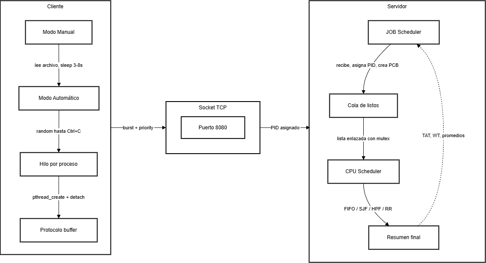

# Proyecto 1 - Simulación de Planificación de Procesos
### Principios de Sistemas Operativos | Escuela de Computación | I Semestre 2026
### Instituto Tecnológico de Costa Rica
### Profesora: Erika Marín Schumann

---

**Integrantes:**
- Luis Vega Rodríguez — 2018161651
- Gabriel Gutiérrez Mata — 2022437833


---

## Índice

1. [Introducción](#introducción)
2. [Estrategia de Solución](#estrategia-de-solución)
3. [Análisis de Resultados](#análisis-de-resultados)
4. [Lecciones Aprendidas](#lecciones-aprendidas)
5. [Casos de Prueba](#casos-de-prueba)
6. [Comparación Java Threads vs PThreads](#comparación-java-threads-vs-pthreads)
7. [Manual de Usuario](#manual-de-usuario)
8. [Bitácora de Trabajo](#bitácora-de-trabajo)
9. [Bibliografía](#bibliografía)

---

## Introducción

El presente documento describe el desarrollo del primer proyecto del curso de Sistemas Operativos, consistente en la implementación de un simulador de planificación de procesos de CPU bajo una arquitectura cliente-servidor.

El simulador fue desarrollado en el lenguaje C para Linux, haciendo uso de la librería PThreads para el manejo de hilos y sockets TCP para la comunicación entre procesos. El sistema permite que un cliente genere procesos con características definidas (tiempo de burst y prioridad) y los envíe a un servidor que los administra y ejecuta según diferentes algoritmos de planificación: First In First Out (FIFO), Shortest Job First (SJF), Highest Priority First (HPF) y Round Robin (RR).

El cliente cuenta con dos modalidades de operación. En el modo manual, los procesos se leen desde un archivo de texto y se envían al servidor con pausas aleatorias entre cada uno. En el modo automático, los procesos se generan de forma aleatoria de manera continua hasta que el usuario decide detener la ejecución. 

En ambos casos, cada proceso es manejado por un hilo independiente que establece su propia conexión con el servidor, envía la información y espera la confirmación con el PID asignado.

Este proyecto permitió poner en práctica conceptos fundamentales de los sistemas operativos como la planificación de CPU, la sincronización de hilos, el manejo de memoria dinámica y la comunicación entre procesos mediante sockets, consolidando tanto conocimientos técnicos como habilidades de trabajo en equipo y organización.  

---

## Estrategia de Solución

### Arquitectura General



El sistema está compuesto por dos programas independientes que se comunican mediante sockets TCP: el cliente y el servidor.

El cliente es el encargado de generar los procesos. Cada proceso se representa como un hilo independiente que establece su propia conexión con el servidor, envía un mensaje con el burst y la prioridad del proceso, espera recibir el PID asignado y luego termina cerrando la conexión. El cliente opera en dos modos: manual, donde lee los procesos desde un archivo de texto con pausas aleatorias entre cada envío, y automático, donde genera procesos con valores aleatorios de forma continua hasta que el usuario lo detiene.

El servidor actúa como el sistema operativo simulado. Contiene dos hilos principales: el JOB Scheduler, que escucha las conexiones entrantes, asigna un PID a cada proceso, crea su PCB y lo coloca en la cola de procesos listos; y el CPU Scheduler, que constantemente revisa la cola y selecciona el siguiente proceso a ejecutar según el algoritmo configurado al inicio. La ejecución de un proceso se simula mediante un sleep de la duración del burst.

La comunicación entre cliente y servidor utiliza un protocolo binario propio implementado con un sistema de buffer que serializa los datos antes de enviarlos y los deserializa al recibirlos. El mensaje del cliente contiene el burst como un entero de 32 bits y la prioridad como un entero de 8 bits. La respuesta del servidor contiene el PID asignado como un entero de 32 bits.

La cola de procesos es compartida entre el JOB Scheduler y el CPU Scheduler, por lo que se protege con un mutex para evitar condiciones de carrera.

### El Cliente

El cliente fue desarrollado en C utilizando la librería PThreads para el manejo de hilos y sockets TCP para la comunicación con el servidor. Su función principal es generar procesos con un burst y una prioridad determinados, y enviarlos al servidor para su planificación.
Al iniciar, el cliente recibe por línea de comandos el modo de operación y el rango de burst permitido. Dependiendo del modo seleccionado, el cliente opera de dos formas distintas.

**Modo Manual**
En este modo el cliente recibe como parámetro el nombre de un archivo de texto que contiene la información de los procesos a enviar. Cada línea del archivo contiene dos valores: el burst y la prioridad del proceso. El cliente lee el archivo línea por línea y por cada proceso válido crea un hilo independiente que se encarga de conectarse al servidor y enviar la información. Si el burst de un proceso está fuera del rango establecido por el usuario, el proceso es ignorado. Entre la lectura de cada proceso se aplica un sleep de duración aleatoria entre 3 y 8 segundos, simulando la llegada gradual de procesos al sistema.

**Modo Automático**
En este modo el cliente genera procesos de forma continua con valores de burst y prioridad aleatorios. El burst se genera dentro del rango definido por el usuario y la prioridad se genera aleatoriamente entre 1 y 10. Por cada proceso generado se crea un hilo independiente que lo envía al servidor. El cliente continúa generando procesos hasta que el usuario presiona Ctrl+C, momento en el que el programa captura la señal SIGINT y termina limpiamente.

**Hilo por proceso**
En ambos modos, cada proceso es manejado por un hilo independiente creado con *pthread_create*. Este hilo establece su propia conexión al servidor mediante un socket TCP, serializa los datos del proceso usando el protocolo de buffer implementado, envía el mensaje al servidor, espera recibir el PID asignado, lo muestra en pantalla y finaliza cerrando la conexión. El hilo se configura con *pthread_detach* para que libere sus recursos automáticamente al terminar.

**Protocolo de comunicación**
La comunicación utiliza un protocolo binario propio implementado con un sistema de buffer que garantiza el orden correcto de los bytes en la red. El mensaje enviado al servidor contiene el burst como un entero sin signo de 32 bits y la prioridad como un entero sin signo de 8 bits. La respuesta del servidor contiene el PID asignado como un entero sin signo de 32 bits.

### El Servidor


**JOB Scheduler:**
> _Describir cómo recibe los procesos, asigna PIDs y construye el PCB._

**CPU Scheduler:**
> _Describir cómo selecciona y ejecuta procesos según el algoritmo configurado._

**Algoritmos implementados:**
> _Describir FIFO, SJF, HPF y Round Robin._

---

## Análisis de Resultados

| # | Funcionalidad | % Realización | Observaciones |
|---|---|---|---|
| 1 | Conexión cliente-servidor por socket | 100% | |
| 2 | Protocolo de serialización binaria | 100% | |
| 3 | Modo manual (lectura de archivo) | 100% | |
| 4 | Modo automático (generación aleatoria) | 100% | |
| 5 | Cada proceso como hilo independiente | 100% | |
| 6 | Rango de burst configurable por usuario | 100% | |
| 7 | Prioridad aleatoria entre 1 y 10 | 100% | |
| 8 | Sleep aleatorio 3-8s entre procesos (manual) | 100% | |
| 9 | Recepción y despliegue del PID asignado | 100% | |
| 10 | JOB Scheduler en el servidor | % | |
| 11 | CPU Scheduler - FIFO | % | |
| 12 | CPU Scheduler - SJF | % | |
| 13 | CPU Scheduler - HPF | % | |
| 14 | CPU Scheduler - Round Robin | % | |
| 15 | Cola de procesos con mutex | % | |
| 16 | Resumen final (TAT, WT, promedios) | % | |
| 17 | Comando para consultar cola en ejecución | % | |

---

## Lecciones Aprendidas

### Técnicas

- **Programación en C con Linux:** Se aprendió a desarrollar aplicaciones en C bajo un entorno Linux, incluyendo la configuración del entorno de desarrollo con WSL2 en Windows y el uso de herramientas como gcc y make para compilar proyectos con múltiples archivos.

- **Manejo de hilos con PThreads:** Se comprendió cómo crear y gestionar hilos en C utilizando la librería PThreads. En particular se aprendió la diferencia entre pthread_join y pthread_detach, optando por detach para que cada hilo de proceso se limpie automáticamente al terminar sin necesidad de esperar por él.
  
- **Comunicación por sockets TCP:** Se aprendió a establecer conexiones TCP en C, incluyendo la creación del socket, la configuración de la dirección del servidor y el proceso de conexión, envío y recepción de datos.
  
- **Serialización de datos con buffer:** Se comprendió la importancia de serializar los datos antes de enviarlos por red para garantizar el orden correcto de los bytes entre diferentes arquitecturas, utilizando funciones como htonl y ntohl.

- **Manejo de señales en C:** Se aprendió a capturar la señal SIGINT generada por Ctrl+C usando signal(), lo que permite detener el modo automático de forma limpia sin dejar hilos o sockets abiertos.
Organización de proyectos en C: Se aprendió a estructurar un proyecto en C con múltiples archivos separando responsabilidades en módulos como protocol.c, buffer.c y client.c, y a compilarlos correctamente usando un Makefile.

- **Control de versiones con Git:** Se practicó el uso de ramas en Git para trabajar de forma independiente sobre la parte del cliente sin afectar el trabajo de los compañeros, y se aprendió a verificar diferencias entre ramas antes de hacer un merge.

### Personales / Trabajo en equipo

- **Importancia de definir el protocolo antes de programar:** Se aprendió que en un proyecto cliente-servidor es fundamental acordar el formato de los mensajes entre ambas partes antes de comenzar a programar de forma independiente, ya que cualquier diferencia en la estructura de los datos impide la comunicación.

- **Construcción incremental del código:** Se comprendió la importancia de construir el programa por etapas, probando cada parte por separado antes de integrarla con el resto, lo que facilita identificar errores y reduces el tiempo de depuración.
  
- **Comunicación con el equipo:** Se reforzó la necesidad de mantener comunicación constante con los compañeros para coordinar cambios en archivos compartidos como los headers del protocolo, evitando conflictos y retrabajos.


---

## Casos de Prueba

### Prueba 1 — Modo Manual básico

| Campo | Detalle |
|---|---|
| **Descripción** | Enviar procesos desde un archivo al servidor usando FIFO |
| **Precondición** | Servidor corriendo con algoritmo FIFO |
| **Comando** | `./client manual procesos.txt 1 20` |
| **Archivo de entrada** | `8 3 / 7 2 / 5 9 / 3 1 / 12 7` |
| **Resultado esperado** | El cliente envía los 5 procesos con sleep entre 3-8s y recibe un PID por cada uno |
| **Resultado obtenido** | El cliente envió todos los procesos correctamente y recibió confirmación de PID |

---

### Prueba 2 — Modo Automático

| Campo | Detalle |
|---|---|
| **Descripción** | Generación automática de procesos hasta Ctrl+C |
| **Precondición** | Servidor corriendo |
| **Comando** | `./client auto 1 20` |
| **Resultado esperado** | El cliente genera procesos indefinidamente con burst entre 1-20 y prioridad entre 1-10 hasta que el usuario presiona Ctrl+C |
| **Resultado obtenido** | El cliente generó procesos continuamente y se detuvo limpiamente con Ctrl+C |

---

### Prueba 3 — Burst fuera de rango (modo manual)

| Campo | Detalle |
|---|---|
| **Descripción** | Verificar que el cliente ignora procesos con burst fuera del rango |
| **Precondición** | Servidor corriendo |
| **Archivo de entrada** | `25 5 / 0 3 / 8 7` (primeros dos fuera de rango 1-20) |
| **Resultado esperado** | Solo el tercer proceso es enviado al servidor |
| **Resultado obtenido** | Los primeros dos fueron ignorados con mensaje de advertencia |

---

### Prueba 4 — Algoritmo FIFO
> _[Le toca al compañero del servidor]_

| Campo | Detalle |
|---|---|
| **Descripción** | |
| **Resultado esperado** | |
| **Resultado obtenido** | |

---

### Prueba 5 — Round Robin con quantum
> _[Le toca al compañero del servidor]_

| Campo | Detalle |
|---|---|
| **Descripción** | |
| **Resultado esperado** | |
| **Resultado obtenido** | |

---

## Comparación Java Threads vs PThreads

| Aspecto | Java Threads | PThreads (C) |
|---|---|---|
| **Lenguaje** | Java | C |
| **Nivel de abstracción** | Alto — orientado a objetos con clase `Thread` e interfaz `Runnable` | Bajo — API de funciones directas sobre el kernel |
| **Facilidad de uso** | Mayor. Sintaxis intuitiva, manejo de errores con excepciones | Requiere más cuidado. Errores manejados con códigos de retorno |
| **Portabilidad** | Multiplataforma gracias a la JVM. Corre igual en Windows, Linux y Mac | Solo en sistemas POSIX: Linux, Unix y macOS. No soportado nativamente en Windows |
| **Memoria por hilo** | ~1 MB de stack por defecto, asignado al momento de creación sin importar si el hilo está activo o dormido | Configurable y de menor overhead. La memoria se gestiona de forma más eficiente |
| **Rendimiento** | Menor rendimiento debido al overhead de la JVM que agrega una capa adicional de abstracción | Mayor rendimiento. Opera directamente sobre el kernel sin intermediarios |
| **Context switch** | Con cientos de hilos el costo de cambio de contexto se vuelve significativo | Menor overhead en context switch al operar directamente con el sistema operativo |
| **Sincronización** | `synchronized`, `ReentrantLock`, `Semaphore`, `wait()`, `notify()` | `pthread_mutex_t`, `sem_t`, `pthread_cond_t` |
| **Creación de hilos** | `new Thread()` o `ExecutorService` | `pthread_create()` |
| **Espera de hilos** | `thread.join()` | `pthread_join()` |
| **Control sobre el hilo** | Limitado por la JVM | Total. El programador controla cada aspecto del ciclo de vida |
| **Uso recomendado** | Aplicaciones empresariales donde importa la productividad y la portabilidad | Programación de sistemas donde el rendimiento y el control son prioritarios |

### Análisis

La tabla anterior presenta una comparación entre los dos modelos de hilos estudiados: Java Threads y PThreads de C.
En cuanto al nivel de abstracción, Java Threads ofrece una interfaz de alto nivel orientada a objetos que simplifica el trabajo con hilos, mientras que PThreads expone directamente las funciones del sistema operativo, dando al programador un control total pero exigiendo mayor responsabilidad en el manejo de recursos.

Respecto a la portabilidad, Java tiene una ventaja clara ya que al correr sobre la JVM el mismo código funciona en cualquier sistema operativo. PThreads en cambio es exclusivo de sistemas POSIX como Linux, Unix y macOS, lo que lo hace menos portable pero más eficiente en esos entornos.

En términos de rendimiento, PThreads supera a Java Threads debido a que opera directamente sobre el kernel sin pasar por una máquina virtual. En Java, la JVM introduce una capa adicional de abstracción que genera overhead tanto en la creación de hilos como en el context switch. 

Adicionalmente, cada hilo de Java consume aproximadamente 1 MB de memoria de stack desde el momento de su creación, sin importar si el hilo está activo o en espera, lo que puede convertirse en un problema cuando hay cientos de hilos corriendo simultáneamente.

En cuanto a la sincronización, ambos modelos ofrecen mecanismos equivalentes. Java lo hace con palabras reservadas como synchronized y clases como ReentrantLock y Semaphore, mientras que PThreads utiliza pthread_mutex_t, sem_t y variables de condición. La diferencia principal es que en Java el manejo de errores se hace mediante excepciones, lo que simplifica el código, mientras que en PThreads cada función retorna un código de error que el programador debe verificar manualmente.

En conclusión, la elección entre uno y otro depende del contexto del proyecto. Java Threads es más adecuado para aplicaciones empresariales donde la portabilidad y la facilidad de desarrollo son prioritarias. PThreads es la opción correcta cuando se requiere control preciso sobre los recursos del sistema y rendimiento máximo, como es el caso de este proyecto de simulación de sistema operativo.

---

## Manual de Usuario

### Requisitos

- Sistema operativo Linux (o WSL en Windows)
- `gcc` y `make` instalados
- Instalar dependencias: `sudo apt install build-essential`

### Compilación

**Servidor:**
```bash
cd server
make
```

**Cliente:**
```bash
cd dummy-client
make
```

**Limpiar archivos compilados:**
```bash
make clean
```

### Ejecución

**Paso 1:** Iniciar el servidor en una terminal:
```bash
cd server
./server
```
El servidor pedirá seleccionar el algoritmo de scheduling:
```
1. FIFO
2. SJF (Shortest Job First)
3. HPF (Highest Priority First)
4. Round Robin (RR)
```

**Paso 2:** En otra terminal, iniciar el cliente:

Modo manual:
```bash
cd dummy-client
./client manual procesos.txt <burst_min> <burst_max>
```

Modo automático:
```bash
cd dummy-client
./client auto <burst_min> <burst_max>
```

**Ejemplos:**
```bash
./client manual procesos.txt 1 20
./client auto 1 20
```

**Paso 3:** Para detener el cliente automático presionar `Ctrl+C`.

**Paso 4:** Para detener el servidor presionar `Ctrl+C`. El servidor mostrará el resumen final.

### Formato del archivo de entrada (modo manual)

```
BURST PRIORIDAD
8 3
7 2
5 9
```

- `BURST`: tiempo de uso del CPU (debe estar dentro del rango especificado)
- `PRIORIDAD`: valor entre 1 (mínima) y 10 (máxima)

---

## Bitácora de Trabajo


#### Semana 1 — 20 de marzo al 27 de marzo

| Actividad realizada |
|---|
 | Lectura del enunciado, definición de la arquitectura general y acuerdo sobre el protocolo de comunicación |
| Configuración del entorno de desarrollo con WSL2 y gcc, implementación del socket básico del cliente e implementación del protocolo buffer |
| Diseño de la estructura del PCB y la cola de procesos, implementación del socket básico del servidor e implementación del JOB Scheduler |
 | Consulta con la profesora en clase |

#### Semana 2 — 27 de marzo al 10 de abril

 | Actividad realizada |
|---|
 | Implementación del modo manual y modo automático, pruebas del cliente con el servidor |
| Implementación de los algoritmos FIFO, SJF, HPF y Round Robin, implementación del resumen final |
| Consulta con la profesora en clase, pruebas de integración, corrección de bugs y redacción de la documentación |


---

## Bibliografía

GeeksforGeeks — POSIX Threads in OS: https://www.geeksforgeeks.org/operating-systems/posix-threads-in-os/

Medium — POSIX Threads, The Simplest Way to Understand Real Multithreading in C: https://medium.com/@techdhaba.training/posix-threads-pthreads-the-simplest-way-to-understand-real-multithreading-in-c-c2f591ab7a03

JavaProgramTo — Java Platform Threads Explained: https://www.javaprogramto.com/2025/07/java-platform-threads-limit-performance-cost.html
